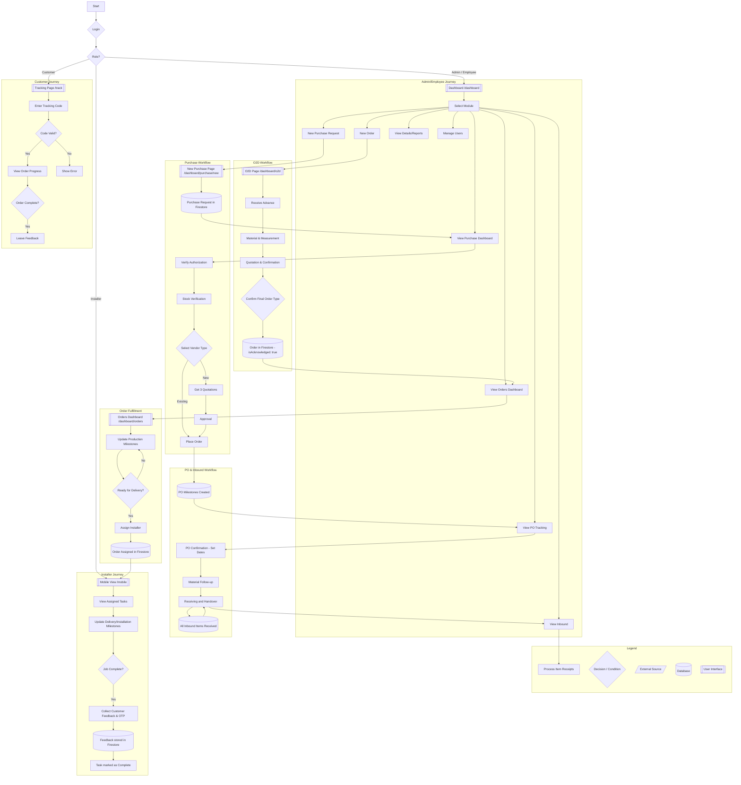

# MoTrack Application Flowchart

This document outlines the main user and data workflows within the MoTrack application using a Mermaid.js flowchart.

```mermaid
graph TD
    subgraph Legend
        direction LR
        L1[Process Step]
        L2{Decision / Condition}
        L3[/External Source/]
        L4[(Database)]
        L5[[User Interface]]
    end

    A[Start] --> B{Login};
    B --> C{Role?};
    C -->|Admin / Employee| D[[Dashboard /dashboard]];
    C -->|Installer| E[[Mobile View /mobile]];
    C -->|Customer| F[[Tracking Page /track]];

    subgraph Admin/Employee Journey
        D --> D1[Select Module];
        D1 --> G[New Order];
        D1 --> H[New Purchase Request];
        D1 --> I[View Orders Dashboard];
        D1 --> J[View Purchase Dashboard];
        D1 --> K[View PO Tracking];
        D1 --> L[View Inbound];
        D1 --> M[View Details/Reports];
        D1 --> N[Manage Users];
    end

    subgraph O2D Workflow
        G --> O2D1[[O2D Page /dashboard/o2d]];
        O2D1 --> O2D2[Receive Advance];
        O2D2 --> O2D3[Material & Measurement];
        O2D3 --> O2D4[Quotation & Confirmation];
        O2D4 --> O2D5{Confirm Final Order Type};
        O2D5 --> O2D_DB[(Order in Firestore - isAcknowledged: true)];
        O2D_DB --> I;
    end

    subgraph Purchase Workflow
        H --> P1[[New Purchase Page /dashboard/purchase/new]];
        P1 --> P_DB[(Purchase Request in Firestore)];
        P_DB --> J;
        J --> P2[Verify Authorization];
        P2 --> P3[Stock Verification];
        P3 --> P4{Select Vendor Type};
        P4 -->|Existing| P5[Place Order];
        P4 -->|New| P6[Get 3 Quotations];
        P6 --> P7[Approval];
        P7 --> P5;
    end
    
    subgraph PO & Inbound Workflow
      P5 --> PO_DB[(PO Milestones Created)];
      PO_DB --> K;
      K --> K1[PO Confirmation - Set Dates];
      K1 --> K2[Material Follow-up];
      K2 --> K3[Receiving and Handover];
      K3 --> IN_DB[(All Inbound Items Received)];
      IN_DB --> K3;
      K3 --> L;
      L --> L1[Process Item Receipts];
    end

    subgraph Order Fulfillment
        I --> T1[[Orders Dashboard /dashboard/orders]];
        T1 --> T2[Update Production Milestones];
        T2 --> T3{Ready for Delivery?};
        T3 -->|Yes| T4[Assign Installer];
        T3 -->|No| T2;
        T4 --> T_DB[(Order Assigned in Firestore)];
    end

    subgraph Installer Journey
        T_DB --> E;
        E --> E1[View Assigned Tasks];
        E1 --> E2[Update Delivery/Installation Milestones];
        E2 --> E3{Job Complete?};
        E3 -->|Yes| E4[Collect Customer Feedback & OTP];
        E4 --> E_DB[(Feedback stored in Firestore)];
        E_DB --> E_Complete[Task marked as Complete];
    end
    
    subgraph Customer Journey
      F --> F1[Enter Tracking Code];
      F1 --> F2{Code Valid?};
      F2 -->|Yes| F3[View Order Progress];
      F2 -->|No| F4[Show Error];
      F3 --> F5{Order Complete?};
      F5 -->|Yes| F6[Leave Feedback];
    end

```
