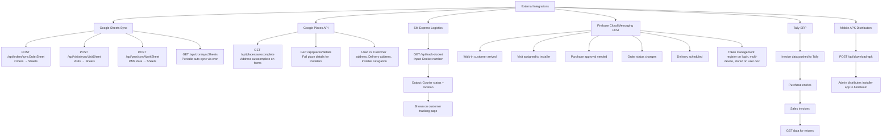

# MoTrack — Full Application Process Flowchart

> **Company:** Mo Designs Pvt. Ltd. | **Purpose:** End-to-end operations management for custom upholstered furniture — from walk-in to delivery.

---

## Table of Contents

1. [System Architecture Overview](#1-system-architecture-overview)
2. [Authentication & Role Access](#2-authentication--role-access)
3. [Walk-in Customer Management](#3-walk-in-customer-management)
4. [CRM & Deal Management](#4-crm--deal-management)
5. [Quotation Builder (Instant)](#5-quotation-builder-instant)
6. [Order-to-Delivery (O2D) Process](#6-order-to-delivery-o2d-process)
7. [Purchase Order Management](#7-purchase-order-management)
8. [Inbound Material Receiving](#8-inbound-material-receiving)
9. [Inventory & Stock Management](#9-inventory--stock-management)
10. [Production Management System (PMS)](#10-production-management-system-pms)
11. [Invoice & Billing](#11-invoice--billing)
12. [Mobile Installer App](#12-mobile-installer-app)
13. [Customer Order Tracking](#13-customer-order-tracking)
14. [Reports & Admin](#14-reports--admin)
15. [Integrations & Data Sync](#15-integrations--data-sync)
16. [Full End-to-End Order Lifecycle](#16-full-end-to-end-order-lifecycle)
17. [Firestore Data Model Quick Reference](#firestore-data-model-quick-reference)

---

## 1. System Architecture Overview

```
┌─────────────────────────────────────────────────────────────────────┐
│                         MOTRACK SYSTEM                              │
├──────────────┬──────────────┬────────────────┬──────────────────────┤
│  PUBLIC ZONE │  MOBILE APP  │  DASHBOARD APP │   ADMIN / BACKEND    │
│              │              │                │                      │
│  /track      │  /mobile     │  /dashboard    │  Firebase Admin SDK  │
│  /scan       │  /mobile/    │  (All modules) │  API Routes (/api/)  │
│  /walk-in    │  completed   │                │  Cron Jobs           │
│              │  /mobile/    │                │  Google Sheets Sync  │
│              │  delivery/   │                │                      │
│              │  measurement/│                │                      │
└──────┬───────┴──────┬───────┴───────┬────────┴──────────┬───────────┘-
       │              │               │                   │
       └──────────────┴───────────────┴───────────────────┘
                                   │
                    ┌──────────────▼──────────────┐
                    │       FIREBASE BACKEND       │
                    │  ┌──────────┐ ┌───────────┐ │
                    │  │Firestore │ │   Auth    │ │
                    │  └──────────┘ └───────────┘ │
                    │  ┌──────────┐ ┌───────────┐ │
                    │  │ Storage  │ │    FCM    │ │
                    │  └──────────┘ └───────────┘ │
                    └──────────────────────────────┘
                                   │
                    ┌──────────────▼──────────────┐
                    │     EXTERNAL INTEGRATIONS    │
                    │  Google Sheets  │  SM Express│
                    │  Google Places  │  Tally ERP │
                    └─────────────────────────────┘
```

**User Roles & Access:**

| Role            | Access Level                                                  |
|-----------------|---------------------------------------------------------------|
| Admin           | Full access to all modules                                    |
| CRM             | Customer, Deal, Quotation, Order management                   |
| PC              | Production coordinator dashboard                             |
| Allocator       | Stock allocation dashboard                                    |
| Purchase        | Purchase orders, Inbound, Stock                               |
| Accounts        | Invoice, Billing, Financial management                        |
| Installer       | Mobile app, Visit completion                                  |
| Cutting         | Cutting operations, Stock scanning                            |
| Salesman        | Salesman dashboard, assigned deals                            |
| PMS             | Production management                                         |

---

## 2. Authentication & Role Access

```mermaid
flowchart TD
    A[Request enters Next.js] --> B[RootLayout: Init Firebase + Providers]
    B --> C[AuthContext resolves user]
    C --> D{Authenticated?}
    D -- No --> E[Show Login Page /]
    D -- Yes --> F{dayOff status?}
    F -- Yes blocked --> E
    F -- No --> G{User role / designation}

    G -->|installer| H[/mobile]
    G -->|Purchase| I[/dashboard/purchase]
    G -->|others| J[/dashboard]

    J --> K[DashboardLayout auth guard]
    K --> L{Still authenticated?}
    L -- No --> E
    L -- Yes --> M[Render AppShell + role-based page]

    M --> N{designation}
    N -->|CRM| O[CrmDashboard CRM mode]
    N -->|PC| P[CrmDashboard PC mode]
    N -->|allocator| Q[AllocatorDashboard]
    N -->|role=salesman| R[SalesmanDashboardV2]
    N -->|role=Accounts| S[AccountsDashboard]
    N -->|role=Purchase| T[Purchase route logic]
    N -->|fallback Admin| U[AdminDashboard]
```

**Session Management:**
- Firebase session persists across reloads
- FCM token registered on login for push notifications
- `dayOff` flag blocks login — blocked users see login page

---

## 3. Walk-in Customer Management

```mermaid
flowchart TD
    A[Customer arrives at store] --> B[/walk-in public form]
    B --> C[Fill Name, Phone, Looking For]
    C --> D[Submit: addWalkinCustomer server action]
    D --> E{Duplicate phone?}
    E -- Yes --> F[Return error: duplicate mobile]
    E -- No --> G[Save to Walkin_Customer collection]
    G --> H{creator provided?}
    H -- No --> I[Query CRM users by role+designation]
    I --> J[Send FCM multicast to all CRM]
    J --> K[Batch create in-app notifications]
    H -- Yes --> L[Skip broadcast]
    K --> M[Return success → form reset]
    L --> M

    M --> N[/dashboard/walk-in - CRM desk]
    N --> O[Real-time Firestore subscription]
    O --> P{Admin?}
    P -- Yes --> Q[See ALL walk-ins]
    P -- No --> R[See own created walk-ins]
    Q --> S[Walk-in table rendered]
    R --> S

    S --> T{Action chosen}
    T -->|Attend| U[attendToWalkin: status = Attended]
    T -->|Handover| V[handoverToSalesman]
    T -->|Delete admin only| W[deleteDoc Walkin_Customer]

    V --> V1[Fetch salesman user doc]
    V1 --> V2[Update status + assignment owner]
    V2 --> V3{Salesman has FCM token?}
    V3 -- Yes --> V4[Send FCM: New Lead Assigned]
    V3 -- No --> V5[Skip FCM]
    V4 --> V6[Create in-app notification]
    V5 --> V6
```

**Status Badge Logic:**

| Status       | Badge Color |
|--------------|-------------|
| Attended     | Blue        |
| Handed Over  | Green       |
| Pending/empty| Secondary   |

---

## 4. CRM & Deal Management

```mermaid
flowchart TD
    A[/dashboard/customers] --> B[Search by Name or Phone]
    B --> C{Customer found?}
    C -- No --> D[Create New Customer]
    C -- Yes --> E[Open Customer Profile /customers/customerId]
    D --> E

    E --> F[View: Deals, Visits, Receipts, Basic Info]
    F --> G[Create New Deal - NewDealDialog]
    G --> H[Assign CRM Rep + Deal Name]
    H --> I[Deal saved to customers/cId/deals/dId]

    I --> J[Deal Detail Page /customers/cId/dId]
    J --> K{Tab selected}

    K -->|Products| L[Add product items to deal]
    L --> L1[Fabric + VAS + Hardware + Notes + Qty]
    L1 --> L2[Saved to deal.products array]

    K -->|Quotations| M[Create Quotation - QuotationForm]
    M --> M1[Add line items with pricing]
    M1 --> M2[GST + discount calculation]
    M2 --> M3[Save to quotations subcollection]
    M3 --> M4{Approval needed?}
    M4 -- Yes --> M5[Manager reviews in /dashboard/approvals]
    M5 --> M6{Decision}
    M6 -- Approve --> M7[Status: Approved]
    M6 -- Reject --> M8[Status: Rejected + reason]
    M7 --> M9[Print Quotation PDF - Standard or Professional]
    M9 --> M10[Convert to Order → O2D begins]
    M4 -- No --> M7

    K -->|Visits| N[Schedule Visit - VisitForm]
    N --> N1[Type: Measurement / Delivery / Service]
    N1 --> N2[Assign Installer]
    N2 --> N3[FCM notification to installer]
    N3 --> N4[Installer completes visit on mobile]
    N4 --> N5[Measurement data + photos saved]
    N5 --> N6[/measurement/mId/edit for CRM review]

    K -->|Summary| O[Deal Summary view]
    O --> O1[All products, quotes, receipts, visits in one view]
```

---

## 5. Quotation Builder (Instant)

```mermaid
flowchart TD
    A[/dashboard/quotation-builder] --> B[Select Customer Type]
    B --> C{Customer type}
    C -->|Existing| D[Search existing customer]
    C -->|New| E[Create customer inline]
    D --> F[Select Store + Invoice Type GOODS/VAS]
    E --> F

    F --> G[Select GST Mode]
    G --> H{GST mode}
    H -->|Inclusive| I[Prices include GST]
    H -->|Exclusive| J[GST added on top]

    I --> K[Add Line Items]
    J --> K
    K --> L[Search item by BCN barcode]
    L --> L1[Auto-fill: name, HSN, rate from stock]
    L1 --> L2[Enter: qty + discount %]
    L2 --> L3[Auto-calc: CGST + SGST amounts]
    L3 --> L4{More items?}
    L4 -- Yes --> L
    L4 -- No --> M[Summary: Subtotal, Discount, GST, Total]

    M --> N{Action}
    N -->|Save| O[Save to quotations collection linked to deal]
    N -->|Print| P[Print Quotation]
    P --> P1{Format}
    P1 -->|Standard| P2[PrintableQuotation.tsx]
    P1 -->|Professional| P3[PrintableQuotationProfessional.tsx]
    N -->|Convert| Q[Convert to Cash Sale / Walk-in Order]
    Q --> Q1[Create Order + Invoice immediately]
    Q1 --> Q2[Order ready for dispatch]
```

---

## 6. Order-to-Delivery (O2D) Process

```mermaid
flowchart TD
    A[Order Created from Quotation] --> S1

    S1[STEP 1: ORDER CREATED\nOrder status: CREATED\nO2D record initialized] --> S2

    S2[STEP 2: ADVANCE PAYMENT RECEIVED\nRecord amount + method + reference\nUnlocks next steps] --> S3

    S3[STEP 3: MEASUREMENT SCHEDULED\nSchedule site visit\nAssign installer or CRM\nVisit type: MEASUREMENT] --> S4

    S4[STEP 4: MEASUREMENT COMPLETED\nInstaller visits site\nDimensions + photos captured\nStatus auto-updated] --> S5

    S5[STEP 5: SELECTION FINALIZED\nFabric + hardware confirmed\nFinal quotation locked] --> S6

    S6[STEP 6: PURCHASE REQUEST RAISED\nMaterial requirements extracted\nPurchase request sent to purchase team] --> S7

    S7[STEP 7: MATERIAL ORDERED\nPOs placed with vendors\nExpected delivery dates set\nPO tracking begins] --> S8

    S8[STEP 8: MATERIAL RECEIVED - INBOUND\nGoods at warehouse\nInbound receipt created\nStock updated] --> S9

    S9[STEP 9: PRODUCTION STARTED\nPMS order created\nJobs allocated to workers\nProduction schedule set] --> S10

    S10[STEP 10: PRODUCTION COMPLETED\nAll jobs marked DONE\nQuality check passed\nReady for delivery] --> S11

    S11[STEP 11: INVOICE GENERATED\nInvoice created GOODS + VAS\nBalance payment requested\nCutting operation triggered] --> S12

    S12[STEP 12: DELIVERY SCHEDULED\nSchedule delivery visit\nAssign delivery team\nCustomer notified] --> S13

    S13[STEP 13: DELIVERY COMPLETED\nInstallation done\nCustomer confirms on /visit/confirm\nOrder: COMPLETED]
```



**O2D Record:** Each step records timestamp + userId. Visual milestone progress bar shown in `/dashboard/o2d`.

---

## 7. Purchase Order Management

```mermaid
flowchart TD
    A[Trigger: O2D Step 6 or Manual] --> B[/dashboard/purchase]

    B --> C[Create Purchase Request]
    C --> C1[Fabric details: name, qty, vendor preference]
    C1 --> C2[Furniture details + required-by date]
    C2 --> C3[Saved to purchaseRequests collection]

    C3 --> D[/dashboard/purchase/pending-po]
    D --> D1[Purchase manager reviews request]
    D1 --> D2{Decision}
    D2 -- Reject --> D3[Return to requester with reason]
    D2 -- Approve --> E[/dashboard/po-gen]

    E --> E1[Generate PO document]
    E1 --> E2[Auto PO Number assigned]
    E2 --> E3[Fill vendor details + line items with HSN/GST]
    E3 --> E4[Set terms + payment info]
    E4 --> E5[Print PO PDF]
    E5 --> E6[Send PO to vendor]

    E6 --> F[/dashboard/po-tracking]
    F --> F1[Track PO milestones]
    F1 --> F2[PO Sent to Vendor]
    F2 --> F3[Order Confirmed by Vendor]
    F3 --> F4[Dispatched by Vendor]
    F4 --> F5[In Transit - SM Express docket tracking]
    F5 --> F6[Received at Warehouse]

    F --> G[Follow-up Management]
    G --> G1[Log vendor calls + notes]
    G1 --> G2[Set reminder dates]
    G2 --> G3[Escalation alerts via FCM]

    F6 --> H[Inbound Module]
```

---

## 8. Inbound Material Receiving

```mermaid
flowchart TD
    A[Goods arrive at warehouse] --> B[/dashboard/inbound]
    B --> C[Select PO Number to receive\n/inbound/receive/poNumber]
    C --> C1[PO details auto-populated\nExpected items shown]

    C1 --> D{Entry method}
    D -->|Manual| E[For each item: verify, qty, batch, price, damage notes]
    D -->|Scan| F[/dashboard/inbound/scan\nBarcode scan for faster GRN]
    E --> G[Create Inbound Record]
    F --> G

    G --> G1[purchaseRequestId + vendor + items received]
    G1 --> G2[Status: Active]

    G2 --> H[Stock Update per item]
    H --> H1[Find or Create stock master by BCN]
    H1 --> H2[Add received qty to availableQty]
    H2 --> H3{Is fabric?}
    H3 -- Yes --> H4[Create length records per roll]
    H4 --> H5[Generate barcode sticker per roll]
    H3 -- No --> H6[Update qty directly on stock master]
    H5 --> H7[Set rack location]
    H6 --> H7

    H7 --> I[/dashboard/purchase-entry]
    I --> I1[Record vendor tax invoice]
    I1 --> I2[Match to inbound record]
    I2 --> I3[GST input claim entry]
    I3 --> I4[Tally sync trigger]

    B --> J[/dashboard/inbound/dealId]
    J --> J1[View all inbound for a specific deal]
    J1 --> J2[InboundProcessTimeline visualization]

    B --> K[/dashboard/stock-verification]
    K --> K1[Physical count vs system count]
    K1 --> K2[Record discrepancies]
    K2 --> K3[Stock adjustment with reason]
```

---

## 9. Inventory & Stock Management

```mermaid
flowchart TD
    A[/dashboard/inventory] --> B[Stock Master by BCN]

    B --> C[Search Stock]
    C --> C1[By BCN / item name / category / status]
    C1 --> C2[View: qty, location, batch, tax details]

    B --> D{Stock Operation}

    D -->|Update Location| E[Move to new shelf/rack\nUpdateBatchRackDialog]

    D -->|Update Tax| F[Edit batch number, GST rate, HSN\nUpdateBatchTaxDialog]

    D -->|Reserve for Order| G[Link stock BCN to order\navailableQty decreases\nreservedQty increases]

    D -->|Scan| H[/dashboard/inventory/scan\nBarcode scan for quick lookup]

    D -->|View History| I[Full audit trail\nAll movements and transactions\nStockHistoryTable]

    B --> J[Stock Lifecycle]
    J --> J1[INBOUND: availableQty increases]
    J1 --> J2[RESERVED: for order allocation\nreservedQty increases]
    J2 --> J3[CUT: fabric cut to order spec]
    J3 --> J4[CONSUMED: used in production]
    J4 --> J5[RETURNED: restocked if unused]

    B --> K[/dashboard/cutting]
    K --> K1[Triggered when invoice generated]
    K1 --> K2[Retrieve cutting list from invoice]
    K2 --> K3[Select fabric lengths to cut]
    K3 --> K4[Mark items as cut]
    K4 --> K5[Generate StockLengthSticker barcodes]
    K5 --> K6[Stock status: Reserved → Cut]
    K6 --> K7[Cutting record saved to Cutting collection]
```

**Stock Quantity Formula:**
```
freeQty = totalQty - reservedQty - consumedQty
```

---

## 10. Production Management System (PMS)

```mermaid
flowchart TD
    A[Order status → IN_PRODUCTION] --> B[POST /api/pms/createOrder]

    B --> B1[Input: Sales Order]
    B1 --> B2[Build routing from products\nlib/pms/routing.ts]
    B2 --> B3[Create Jobs per operation\ne.g. Cut → Sew → Assemble]
    B3 --> B4[Set job dependencies]
    B4 --> B5[Estimate required minutes per job]

    B5 --> C[GET /api/pms/simulateETA]
    C --> C1[Simulate production timeline]
    C1 --> C2[Calculate ETA per order]
    C2 --> C3[Check machine capacity]
    C3 --> C4[Identify bottlenecks]

    C4 --> D[POST /api/pms/runAutopilot]
    D --> D1[Fetch unscheduled jobs]
    D1 --> D2[Sort by priority and deadline]
    D2 --> D3[Find available machine time slots]
    D3 --> D4[Assign worker to job]
    D4 --> D5[Create plan records]
    D5 --> D6[Respect working hours config]

    D6 --> E[/dashboard/pms - WorkStatusPanel]
    E --> E1[Worker sees assigned jobs]
    E1 --> F{Job Action}

    F -->|Start| G[POST /api/pms/startJob]
    G --> G1[Status: IN_PROGRESS]
    G1 --> G2[workLog entry created with timestamp]

    F -->|Pause| H[Close work log entry\nRecord pause reason]

    F -->|Complete| I[POST /api/pms/completeJob]
    I --> I1[Status: DONE]
    I1 --> I2[Total time calculated from work logs]
    I2 --> I3[Next dependent job UNLOCKED]

    I3 --> J[POST /api/pms/autoAdvance]
    J --> J1{All jobs DONE?}
    J1 -- Yes --> J2[Update order production status]
    J2 --> J3[Trigger O2D Step 10 milestone]
    J1 -- No --> J4[Wait for remaining jobs]

    J2 --> K[POST /api/pms/syncWorkSheet]
    K --> K1[Sync production data to Google Sheets]
```

**Job Status Flow:**
```
WAITING → PLANNED → IN_PROGRESS → DONE
                                   └→ Dependent job UNLOCKED
```

---

## 11. Invoice & Billing

```mermaid
flowchart TD
    A[Trigger: O2D Step 11 or Order READY] --> B[/dashboard/invoice/new]

    B --> B1{Invoice Type}
    B1 -->|GOODS| B2[Physical products invoice]
    B1 -->|VAS| B3[Value-added services invoice]

    B2 --> C[Select Order/Deal to invoice]
    B3 --> C
    C --> C1[Auto-fill: customer GSTIN, addresses, line items, HSN codes, GST rates]

    C1 --> D[Invoice Calculation - invoice-utils.ts]
    D --> D1[Subtotal per line item]
    D1 --> D2[Item-level discount applied]
    D2 --> D3{State: same or different?}
    D3 -->|Intra-state| D4[CGST + SGST applied]
    D3 -->|Inter-state| D5[IGST applied]
    D4 --> D6[Advance payment deducted]
    D5 --> D6
    D6 --> D7[Balance due calculated]
    D7 --> D8[Round-off + TDS if applicable]

    D8 --> E[Invoice Saved]
    E --> E1[Auto-increment invoice number]
    E1 --> E2[Status: Draft → Confirmed]
    E2 --> E3[Cutting operation triggered]

    E3 --> F{Action}
    F -->|Print| G[PrintableInvoice.tsx\nGST invoice format + letterhead + QR]
    F -->|Log| H[/dashboard/invoice - InvoiceLogTable\nFilter by date/customer, download XLSX]
    F -->|Stock Mismatch| I[StockMismatchDialog\nOverride with reason]
    F -->|Tally Sync| J[Push to Tally ERP\nLedger entries + GST returns data]

    E3 --> K[/dashboard/billing and /dashboard/fms]
    K --> K1[Metrics: Total invoiced, Advance collected, Balance outstanding, GST liability]
```

---

## 12. Mobile Installer App

```mermaid
flowchart TD
    A[Installer logs in → Role: Installer] --> B[Redirect to /mobile]

    B --> C[MobileView.tsx - Tabs]
    C --> D{Tab selected}

    D -->|TODAY| E[InstallerVisitsList.tsx\nToday's assigned visits]
    D -->|UPCOMING| F[Future scheduled visits]
    D -->|COMPLETED| G[/mobile/completed - CompletedVisitsList.tsx]

    E --> H[Tap visit to begin]
    H --> I{Visit Type}

    I -->|MEASUREMENT| J[/mobile/measurement/visitId]
    J --> J1[View order details + room list]
    J1 --> J2[Record room dimensions]
    J2 --> J3[Capture photos per room]
    J3 --> J4[Add product-level notes]
    J4 --> J5[Submit measurements]
    J5 --> J6[Data saved to deal subcollection]

    I -->|DELIVERY| K[/mobile/delivery/visitId]
    K --> K1[View delivery items list]
    K1 --> K2[Record delivery condition]
    K2 --> K3[Before/after photos]
    K3 --> K4[Customer satisfaction rating]
    K4 --> K5[Submit delivery report]

    J6 --> L[/visit/confirm/visitId]
    K5 --> L
    L --> L1[Customer-facing confirmation screen]
    L1 --> L2[Customer confirms receipt]
    L2 --> L3[Status → COMPLETED]
    L3 --> L4[O2D milestone auto-updated]

    B --> M[Real-time Location Tracking]
    M --> M1[useInstallerTracking hook]
    M1 --> M2[GPS position every 20 seconds]
    M2 --> M3[POST /api/track/ping]
    M3 --> M4[Stored in Firestore]
    M4 --> M5[InstallerLiveMap on dashboard shows location]

    B --> N[FCM Push Notifications]
    N --> N1[New visit assigned]
    N1 --> N2[Visit rescheduled]
    N2 --> N3[Customer not available alert]
    N3 --> N4[Urgent delivery updates]
```

---

## 13. Customer Order Tracking

```mermaid
flowchart TD
    A[Customer wants to track order] --> B{Access method}

    B -->|URL| C[/track - Enter Order ID or Phone]
    B -->|QR Scan| D[/scan - Scan QR on delivery note]

    C --> E[track/actions.ts: search orders]
    D --> F[scan/actions.ts: resolve barcode to order]
    E --> G[CustomerTracking.tsx]
    F --> G

    G --> H[Display order summary]
    H --> H1[Current milestone status]
    H1 --> H2[Visual progress steps]
    H2 --> H3[Expected delivery date]
    H3 --> H4{Order dispatched?}

    H4 -- Yes --> I[GET /api/track-docket]
    I --> I1[Call SM Express Logistics API]
    I1 --> I2[Return courier status + location]
    I2 --> I3[Show docket tracking to customer]
    H4 -- No --> J[Show production/preparation status]
```

---

## 14. Reports & Admin

```mermaid
flowchart TD
    A[Admin / Manager functions]

    A --> B[/dashboard/reports]
    B --> B1[Filter: date range, user, order status]
    B1 --> B2[Report types: Sales performance, Order volume, Visit completion]
    B2 --> B3[Download as XLSX]

    A --> C[/dashboard/user-report]
    C --> C1[Per-user: deals, orders, visits, revenue]

    A --> D[/dashboard/Sales]
    D --> D1[Daily/weekly/monthly sales]
    D1 --> D2[Top performers + pipeline value]

    A --> E[/dashboard/users - UserManagement.tsx]
    E --> E1[View all users - UserTable]
    E1 --> E2[Create user - UserFormDialog]
    E2 --> E3[Edit role + permissions]
    E3 --> E4[Assign CRM territories - SalesmanCrmAssignments]
    E4 --> E5[Set day-off status]
    E5 --> E6[Handover assignments - POST /api/account/handover]

    A --> F[/dashboard/approvals]
    F --> F1[Pending quotation approvals]
    F1 --> F2[Pending order approvals]
    F2 --> F3[Purchase request approvals]
    F3 --> F4{Decision}
    F4 -- Approve --> F5[Status: Approved → next step unlocked]
    F4 -- Reject --> F6[Status: Rejected + reason recorded]

    A --> G[GET /api/admin/daily-stats]
    G --> G1[Pending orders count]
    G1 --> G2[Pending quotations count]
    G2 --> G3[Walk-ins today]
    G3 --> G4[Purchase follow-ups due]
    G4 --> G5[Deliveries scheduled today]
```

---

## 15. Integrations & Data Sync



---

## 16. Full End-to-End Order Lifecycle

```mermaid
flowchart TD
    WI[Walk-in Customer arrives] --> W1[Walk-in form submitted]
    W1 --> W2[FCM alert to CRM team]
    W2 --> W3[CRM attends / handovers]

    W3 --> CR1[Search or Create Customer]
    CR1 --> CR2[Create Deal]
    CR2 --> CR3[Add products of interest]
    CR3 --> CR4[Schedule Measurement Visit]

    CR4 --> IN1[Installer goes to site]
    IN1 --> IN2[Capture dimensions + photos]
    IN2 --> IN3[Submit measurement data]
    IN3 --> IN4[CRM reviews measurements]

    IN4 --> SEL[Finalize fabric + material selection]
    SEL --> QT1[Create Quotation]
    QT1 --> QT2[Manager approves quotation]
    QT2 --> QT3[Advance payment collected]
    QT3 --> QT4[Convert Quotation → Order]

    QT4 --> PUR1[Purchase Request created]
    PUR1 --> PUR2[PO generated and sent to vendor]
    PUR2 --> PUR3[PO tracked via SM Express docket]
    PUR3 --> PUR4[Goods received at warehouse - Inbound]

    PUR4 --> STK1[Stock master updated with BCN]
    STK1 --> STK2[Stock allocated to order]

    STK2 --> PMS1[PMS Order created from routing]
    PMS1 --> PMS2[Jobs scheduled on workers/machines]
    PMS2 --> PMS3[Workers execute jobs - Start / Pause / Complete]
    PMS3 --> PMS4[All jobs DONE → Order: READY]

    PMS4 --> INV1[Invoice generated GOODS + VAS]
    INV1 --> INV2[Balance payment requested]
    INV2 --> INV3[Cutting operations - fabric cut to spec]
    INV3 --> INV4[Barcode stickers generated]

    INV4 --> DEL1[Delivery visit scheduled]
    DEL1 --> DEL2[Installer delivers and installs]
    DEL2 --> DEL3[Customer confirms on /visit/confirm]
    DEL3 --> DEL4[Order status: COMPLETED]

    DEL4 --> RPT[Reports updated + Revenue recorded]
    DEL4 --> TRK[Customer can track via /track anytime]
```



---

## Firestore Data Model Quick Reference

```
Firestore Collections
│
├── users/                          # Staff accounts + roles + FCM tokens
│
├── customers/                      # Customer master records
│   └── {customerId}/
│       ├── deals/                  # Deals / projects per customer
│       │   └── {dealId}/
│       │       ├── quotations/     # Quotation versions
│       │       └── measurements/  # Site measurement records
│       └── visits/                # Visit history per customer
│
├── orders/                         # Main order records
│   └── {orderId}/
│       └── allocations/           # Stock allocations per order
│
├── purchaseRequests/               # Material purchase requests
├── inbounds/                       # Goods receipt records
│
├── stock/                          # Inventory master (keyed by BCN)
│   └── {bcn}/
│       ├── lengths/               # Per-roll tracking (fabric)
│       └── transactions/          # Stock movement audit log
│
├── jobs/                           # PMS production jobs
│   └── {jobId}/
│       └── workLogs/              # Time tracking entries per job
│
├── plan/                           # PMS job schedule (machine + worker slots)
├── invoices/                       # Generated GST invoices
├── o2d/                            # 13-step order-to-delivery tracking
├── Walkin_Customer/                # Walk-in customer log
├── visits/                         # Field visit records
├── Cutting/                        # Cutting operation records
├── notifications/                  # In-app notification inbox
└── Handover_Register/              # CRM assignment handovers
```

**Key Quantity Fields on Stock:**
| Field        | Meaning                              |
|-------------|--------------------------------------|
| totalQty    | Total ever received                  |
| availableQty| In stock, not reserved               |
| reservedQty | Allocated to an order                |
| consumedQty | Used/cut in production               |
| freeQty     | availableQty - reservedQty           |

---

*Generated: 2026-03-14 | MoTrack v1 | Mo Designs Pvt. Ltd.*
